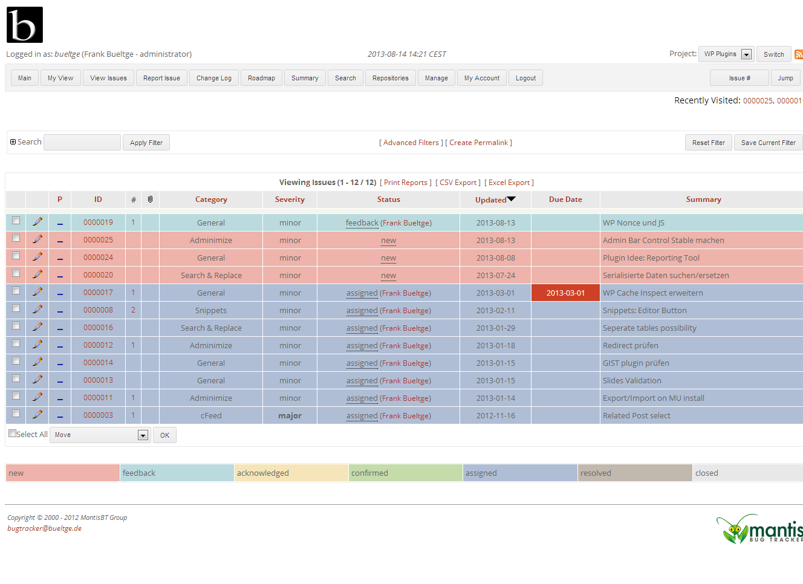

# Colorized, a MantisBT Stylesheet

[](https://travis-ci.org/bueltge/MantisBT-Colorized) [](http://opensource.box.com/badges) [](https://codeclimate.com/github/bueltge/wp-rest-api-filter-items) [](https://opensource.org/licenses/mit-license.php)   

Just another theme for [Mantis BugTracker](http://www.mantisbt.org/), the free web-based bugtracking system.

This style uses the magic of CSS to transform in a new style - simple, fast and useful, without images, pure css.

## Screenshots
 * Buglist View


 * [Screenshot of the Issue](assets/screenshot-2.png "Issue")

## Installation
### Requirements
 * MantisBT 1.3*, For smaller version of MantisBT use the version of the [branch 1.2](https://github.com/bueltge/MantisBT-Colorized/tree/MantisVersion1.2.x)

### Installation
 1. Download
 2. Unpack the package
 3. Create a folder: `<mantis-root>/colorized`
 4. Copy all files from the unpacked folder `colorized/*` to `<mantis_root>/colorized/`
 5. Add the following line to your `config_inc.php` to change the css file included into MantisBT:

     ```php
     $g_css_include_file = "colorized/colorized.css";
     ```
 6. The followed two steps are optional.

     6.1 Status Colors
     
     If you will also use the same colors for your status graph, then add the follow snippet in your `config_inc.php`

     ```php
     # --- Colors ---
     $g_status_colors['new']          = '#eeb3aa';
     $g_status_colors['feedback']     = '#badade';
     $g_status_colors['acknowledged'] = '#f5e5b8';
     $g_status_colors['confirmed']    = '#c5dba9';
     $g_status_colors['assigned']     = '#afbed5';
     $g_status_colors['resolved']     = '#c1b9ae';
     $g_status_colors['closed']       = '#e8e8e8';
     ```

     6.2 More user-friendly select boxes 
     
     You can also use the plugin [Chosen for MantisBT](https://github.com/bueltge/Chosen-for-MantisBT). Chosen is a jQuery plugin that makes long, unwieldy select boxes much more user-friendly.

# Other Notes

### License
Good news, this script is free for everyone! Since it's released under [the MIT](./LICENSE.txt).
But if you enjoy this style, you can thank me and leave a [donation](http://bueltge.de/wunschliste/) for the time I've spent writing and supporting this project. And I really don't want to know how many hours of my life this plugin has already eaten ;)

### Changelog
Read the separate [changelog file.](./CHANGELOG.md)

### Contact & Feedback
This script is designed and developed by me ([Frank Bültge](http://bueltge.de)), [G+ Page](https://plus.google.com/111291152590065605567/about?rel=author)

Please let me know if you like the plugin or you hate it or whatever ... Please fork it, add an issue for ideas and bugs.

### Disclaimer
I'm German and my English might be gruesome here and there. So please be patient with me and let me know of typos or grammatical farts. Thanks
